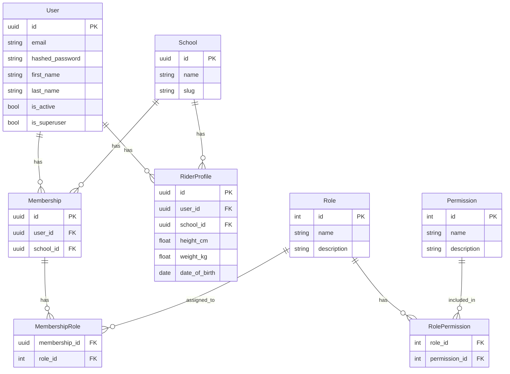

# Riding School Progress Tracker

A production-grade multi-tenant SaaS platform for tracking rider progress through various grades.

## Core Features
- **Multi-tenancy**: Secure isolation between different riding schools.
- **Onboarding**: Self-service registration and school creation.
- **Rider Management**: Track riders and their achievements per school.
- **Auth**: JWT-based authentication with granular Role-Based Access Control (RBAC).

## Data Architecture

The application uses a relational schema with a strong focus on tenant isolation.



## Getting Started

### Prerequisites
- Docker and Docker Compose

### Running the App
1. Clone the repository.
2. Run `docker-compose up --build`.
    - *Note: The backend container runs Alembic migrations (`alembic upgrade head`) on startup before launching the API server.*
3. Open [http://localhost:5173](http://localhost:5173) to see the landing page.
4. Access the API documentation at [http://localhost:8000/docs](http://localhost:8000/docs).

### Clean Build (No Existing Data)
To remove all Docker containers, images, networks, and volumes (including PostgreSQL data), run:
```bash
docker system prune -a --volumes -f
```

Then rebuild and start from scratch:
```bash
docker-compose up --build
```

## Database Management

The project uses **Alembic** for database schema migrations.

### Running Migrations Manually
If you need to apply migrations manually (e.g., during development without restarting the container):
```bash
docker-compose run backend alembic upgrade head
```

### Migration Startup Behavior
The backend Docker image starts with `backend/start.sh`, which runs:
```bash
alembic upgrade head
```
before starting Uvicorn. If migrations fail, the backend container exits and the API does not start with a stale schema.

### Creating a New Migration
When you modify SQLAlchemy models in `backend/app/models`, generate a new migration file:
```bash
docker-compose run backend alembic revision --autogenerate -m "Description of changes"
```
Review the generated file in `backend/alembic/versions/` before committing.

## Testing

### End-to-End Tests (Playwright)
E2E tests verify the full user journey and multi-tenant isolation.
```bash
# Ensure the app is running first
# In a new terminal:
cd e2e
npm install
npx playwright test
```

### Backend Tests (Pytest)
```bash
# Run tests locally (requires python env)
cd backend
PYTHONPATH=. pytest

# Or via Docker
docker-compose run -e PYTHONPATH=. backend pytest
```

### Frontend Tests (Vitest)
```bash
docker-compose run frontend npm run test -- --run
```

## Project Structure
- `backend/`: FastAPI application.
    - `alembic/`: Database migration scripts.
    - `app/models/`: SQLAlchemy database models.
    - `app/api/`: API route handlers.
- `frontend/`: Vite + React + TypeScript + Tailwind v4.
- `e2e/`: Playwright end-to-end tests.
- `docker-compose.yml`: Local development orchestration.
