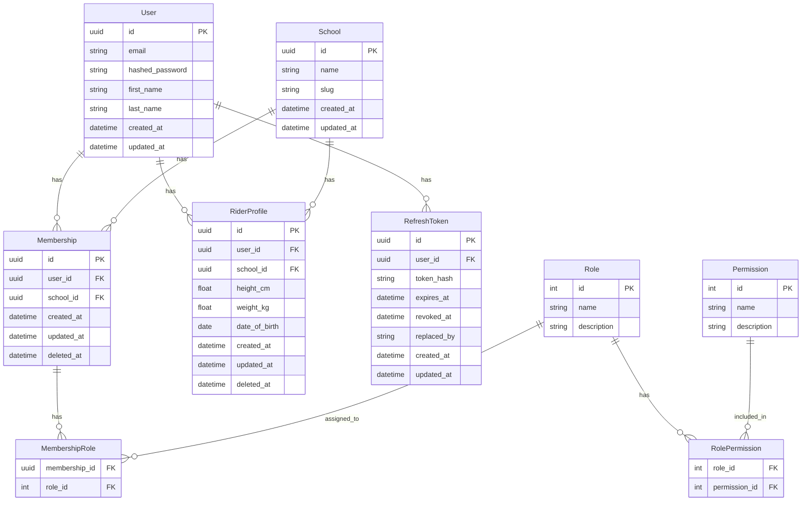

# Riding School Progress Tracker

A production-grade multi-tenant SaaS platform for tracking rider progress through various grades.

## Core Features
- **Multi-tenancy**: Secure isolation between different riding schools.
- **Onboarding**: Self-service registration and school creation.
- **Rider Management**: Track riders and their achievements per school.
- **Auth**: JWT-based authentication with granular Role-Based Access Control (RBAC).

## Data Architecture

The application uses a relational schema with a strong focus on tenant isolation.



## Getting Started

### Option A: Run Without Docker

#### System Dependencies
- Python 3.12+
- Node.js 20+ and npm
- (Optional) PostgreSQL 16 if you want parity with Docker; local development can use SQLite

#### Backend (Local)
```bash
cd backend
python -m venv venv
source venv/bin/activate
pip install -r requirements.txt

# Optional for local app run without Postgres
export DATABASE_URL=sqlite:///./local.db

# Apply schema
alembic upgrade head

# Run API
uvicorn app.main:app --host 0.0.0.0 --port 8000 --reload
```

#### Frontend (Local)
```bash
cd frontend
npm install
npm run dev
```

#### Access URLs
- Frontend: [http://localhost:5173](http://localhost:5173)
- API Docs: [http://localhost:8000/docs](http://localhost:8000/docs)

### Option B: Run With Docker

**Prerequisites:** Docker and Docker Compose

```bash
docker-compose up --build
```

Access URLs:
- Frontend: [http://localhost:5173](http://localhost:5173)
- API Docs: [http://localhost:8000/docs](http://localhost:8000/docs)

*Note: The backend container runs Alembic migrations (`alembic upgrade head`) on startup before launching Uvicorn.*

### Clean Docker Reset (No Existing Data)
```bash
docker system prune -a --volumes -f
docker-compose up --build
```

## Testing

### Backend Tests (Pytest)

Local:
```bash
cd backend
source venv/bin/activate
PYTHONPATH=. pytest
```

Docker:
```bash
docker-compose run -e PYTHONPATH=. backend pytest
```

### Frontend Tests (Vitest)

Local:
```bash
cd frontend
npm install
npm test -- --run
```

Docker:
```bash
docker-compose run frontend npm run test -- --run
```

### End-to-End Tests (Playwright)

Outside Docker:
```bash
# Terminal 1: backend
cd backend
source venv/bin/activate
export DATABASE_URL=sqlite:///./local.db
alembic upgrade head
uvicorn app.main:app --host 0.0.0.0 --port 8000 --reload

# Terminal 2: frontend
cd frontend
npm install
npm run dev

# Terminal 3: e2e
cd e2e
npm install
npx playwright install chromium
npx playwright test
```

Docker alternative:
```bash
docker-compose up --build
cd e2e
npm install
npx playwright install chromium
npx playwright test
```

## Database Management

The project uses **Alembic** for database schema migrations.

Current baseline migration history is reset to a single initial revision:
- `backend/alembic/versions/0001_initial_schema.py`

### Apply Migrations

Local:
```bash
cd backend
source venv/bin/activate
alembic upgrade head
```

Docker:
```bash
docker-compose run backend alembic upgrade head
```

### Create a New Migration

Local:
```bash
cd backend
source venv/bin/activate
alembic revision --autogenerate -m "Description of changes"
```

Docker:
```bash
docker-compose run backend alembic revision --autogenerate -m "Description of changes"
```

Review generated files in `backend/alembic/versions/` before committing.

## Project Structure
- `backend/`: FastAPI application.
    - `alembic/`: Database migration scripts.
    - `app/models/`: SQLAlchemy database models.
    - `app/api/`: API route handlers.
- `frontend/`: Vite + React + TypeScript + Tailwind v4.
- `e2e/`: Playwright end-to-end tests.
- `docker-compose.yml`: Local development orchestration.
